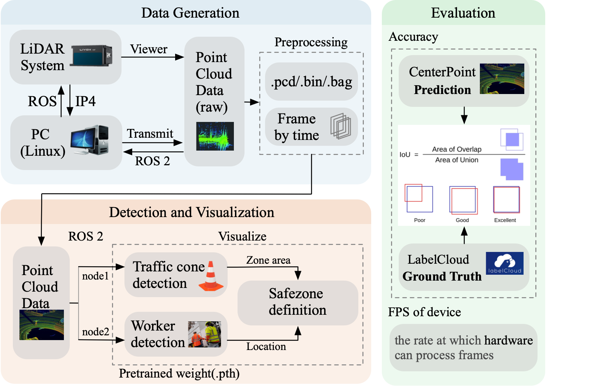
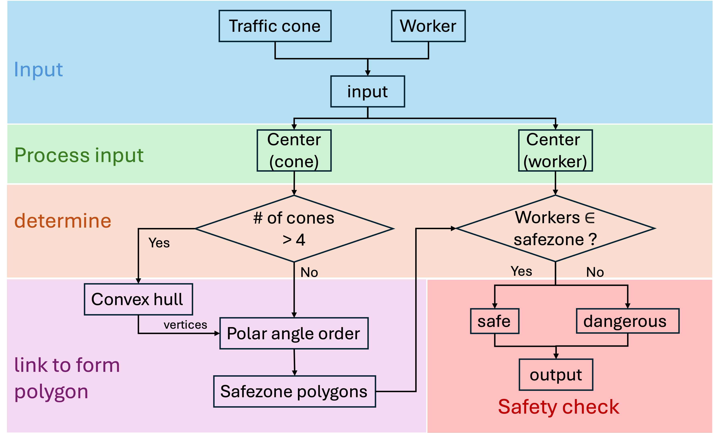
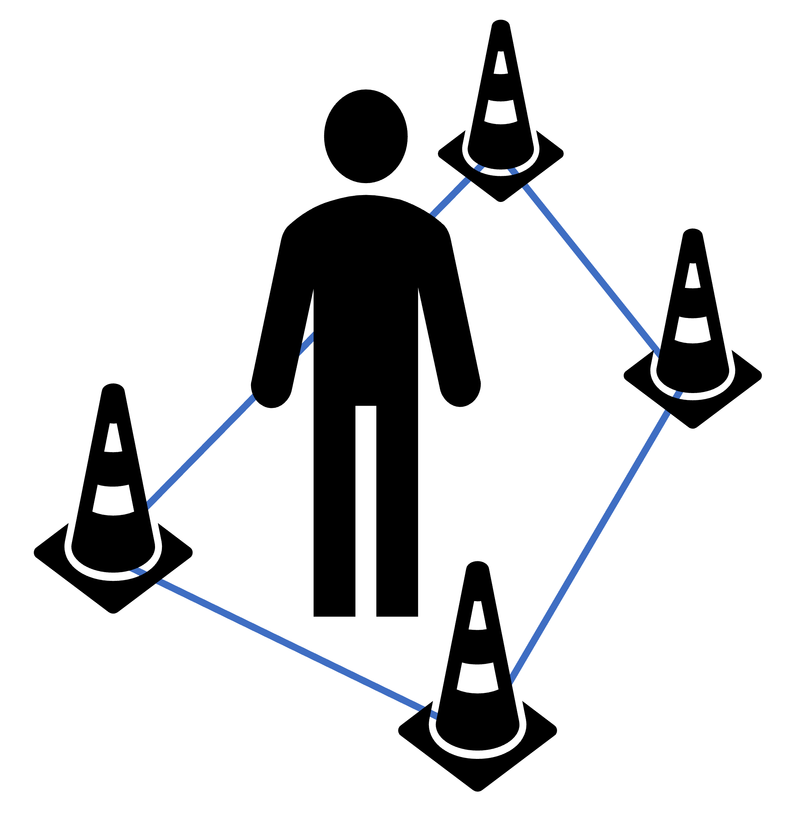

# Apollo_Centerpoint_LiDAR

## 项目简介

.zip为25Spring I2I完整课程项目设计.
该部分只介绍我的safezone definition部分.

## 项目描述
### 实验setup
<div align = "center"> 


</div>
<div align = "center"> 

</div>

### 结构设计
<div align = "center"> 

</div>


## 算法结构
### Flowchart 
<div align = "center"> 

</div>

### 具体流程

我们从目标检测部分拿到检测结果(输出数据), 下一步需要利用这些数据定义一个我们需要的安全区,然后在工人的位置变动时实时判断工人是否迈出安全区,并将结果打印出来以实现安全监测.
<div align = "center"> 

</div>

检测的结果是包含8个点位置坐标的3D结构:
```
box = {
    "class": "traffic_cone",
    "points": [(x1, y1), (x2, y2), ..., (x8, y8)]
}

box = {
    "class": ”workers",
    "points": [(x1, y1), (x2, y2), ..., (x8, y8)]
}
```

## 结果展示

